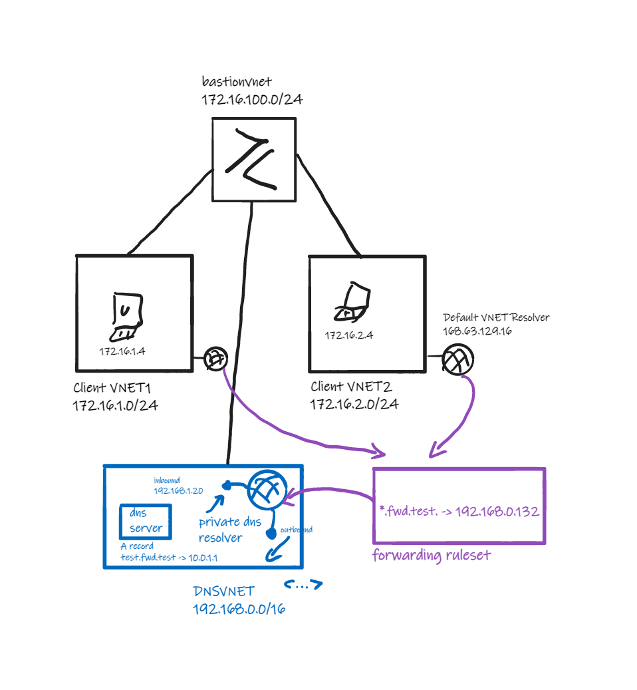

# **Private DNS Resolver with Forwarding Rules**
#Introduction
This lab demonstrates use of the [DNS Forwarding Rulesets](https://learn.microsoft.com/en-us/azure/dns/private-resolver-endpoints-rulesets#dns-forwarding-rulesets) feature to forward DNS requests from VNETs to a DNS server, either in a VNET or on-premise, *without* network connectivity between VNETs.

The lab consists of:
- Two Client VNETs each containing a client VM.
- A DNS VNET containing:
  - A Private DNS Resolver instance with inbound and outbound endpoints.
  - A DNS Server VM containing zone and A record entry for the FQDN `test.fwd.test`.
- DNS Forwarding Ruleset linked to the Client VNETs and the Private DNS Resolver.
- A Bastion VNET containing a Bastion instance, peered to all three VNETs.
 
There is no network connectivity between the Client and DNS VNETs; they are not directly peered and VMs in these VNETs cannot reach one another.

 